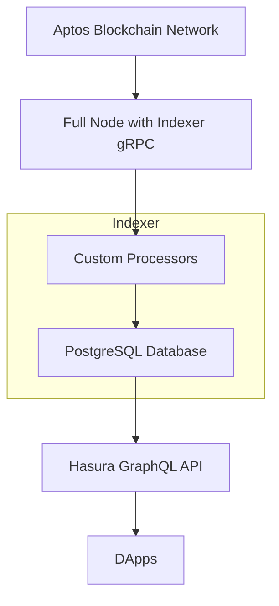

## Running the Aptos Indexer


This repository contains a Docker Compose setup for running a complete self-hosted Aptos Indexer stack with the following components:

### Architecture Components



This docker compose contains

- **Aptos Full Node**: Blockchain node with indexer gRPC enabled (port 50051) that syncs with the Aptos network
- **Indexer Processor**: Connects directly to the full node's gRPC stream and processes transactions
- **PostgreSQL Database**: Stores indexed blockchain data
- **Hasura GraphQL Engine**: Provides GraphQL API for querying indexed data


This setup allows you to run all available Aptos indexer processors to comprehensively index the Aptos blockchain.

## Available Processors

1. **account_transactions_processor** - Indexes account transaction history
2. **ans_processor** - Indexes Aptos Name Service (ANS) data
3. **coin_processor** - Indexes coin activities, balances, and supply
4. **default_processor** - Indexes core blockchain data (blocks, transactions, etc.)
5. **events_processor** - Indexes blockchain events
6. **fungible_asset_processor** - Indexes fungible asset data
7. **nft_metadata_processor** - Indexes NFT metadata
8. **objects_processor** - Indexes on-chain objects
9. **stake_processor** - Indexes staking data
10. **token_v2_processor** - Indexes Token V2 standard data
11. **transaction_metadata_processor** - Indexes transaction metadata
12. **user_transaction_processor** - Indexes user transactions

## Prerequisites

1. Docker and Docker Compose installed
2. Sufficient disk space for full node and PostgreSQL data
3. Stable internet connection for initial blockchain sync

## Setup

1. Download mainnet genesis and waypoint files (if not already done):
   ```bash
   ./download-mainnet-files.sh
   ```

2. Run all processors with local full node:
   ```bash
   docker compose -f docker-compose.all-processors.yml up -d
   ```

3. To run specific processors only, comment out the unwanted services in `docker-compose.all-processors.yml`

## Resource Requirements

Running all processors with a local full node requires significant resources:
- **CPU**: 8+ cores recommended
- **RAM**: 32GB+ recommended
- **Storage**:
   - 500GB+ for full node blockchain data
   - 50-200GB for PostgreSQL database (varies by processors)
   - Total: 700GB+ SSD recommended
- **Network**: Stable internet connection for initial sync

## Monitoring

- Full node REST API: http://localhost:8080
- Full node metrics: http://localhost:6182
- PostgreSQL: localhost:5432
- Hasura GraphQL console: http://localhost:8090
- Each processor exposes health check on port 8084 (internally)

## Processor Configuration

Each processor has its own configuration file in `config/processors/`. The configuration includes:
- Starting version (default: 0 for genesis)
- Batch size and thread count
- Database connection settings
- GRPC endpoint configuration

To customize a specific processor, edit its configuration file in `config/processors/`.

## Database Schema

Each processor creates its own tables in the PostgreSQL database. The schema is automatically managed by the processors.

## Important Notes

- **Initial Sync Time**: Full node sync from genesis takes 24-48 hours for mainnet
- **Storage Growth**: Both full node and database storage will grow over time
- **Self-Contained**: No external dependencies or auth tokens needed
- **Local GRPC**: All processors connect to local full node at `http://fullnode:50051`

## Troubleshooting

1. Check full node sync status:
   ```bash
   docker logs aptos-fullnode
   curl http://localhost:8080/v1
   ```

2. Check processor logs:
   ```bash
   docker logs aptos-[processor-name]-processor
   ```

3. Check database connectivity:
   ```bash
   docker logs aptos-indexer-db
   ```

4. Verify full node GRPC is running:
   ```bash
   netstat -an | grep 50051
   ```

## Scaling Considerations

- For production use, consider running processors on separate machines
- Use a dedicated PostgreSQL instance with proper backup strategies
- Monitor disk usage as the database grows over time
- Consider using only the processors you need rather than all of them
